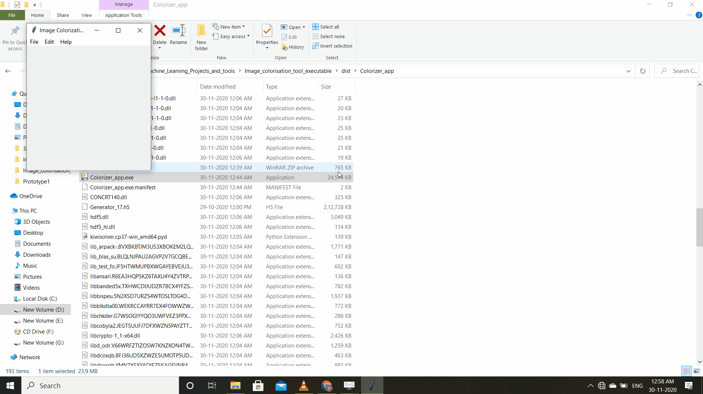

# ImageColorizer
This a GAN based Image colorization desktop app which can be run on any desktop platform. I haven't included the pyinstaller build of the app as it was quite huge in size.
It doesn't require GPU for faster prediction.

# Requirements.
#### Numpy
#### OpenCV
#### Matplotlib
#### Tensorflow(CPU version is okay too)
#### PIL
#### Keras

# Note:- The builded version of the app doesn't requires any libraries or python installed.

## To run the app we can execute `python Colorizer_app.py` from the app directory.

# APP IN ACTION.

